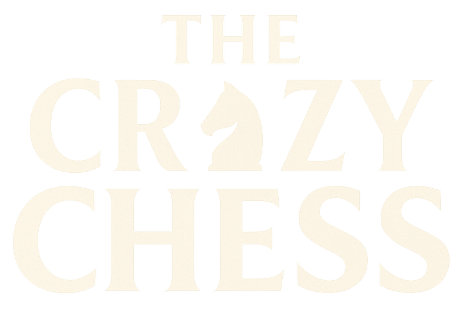
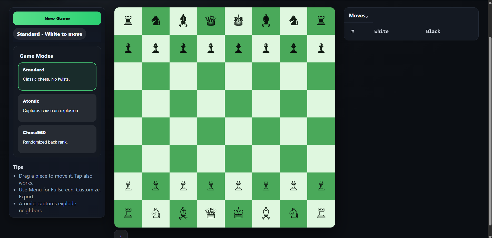
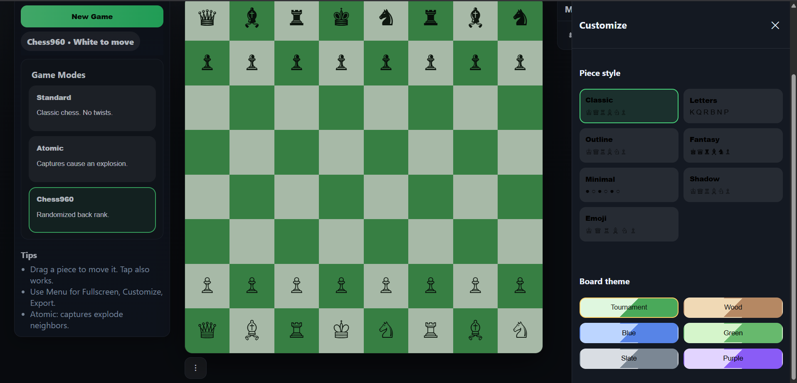

# ♞ The Crazy Chess



A modern **two-player chess game** built with **HTML, CSS, and JavaScript**.  
Play **Standard Chess**, experiment with **Atomic Chess** explosions 💥, or try your luck with **Chess960** randomized starting positions.  
Inspired by platforms like *chess.com* but designed to be lightweight and customizable.

---

## 🚀 Live Demo
👉 [Play Crazy Chess on Vercel](https://thecrazychess.vercel.app) *(coming soon!)*  

---

## 🎮 Features

- ♟️ **Drag & Drop Physics** – Smooth piece movement that feels natural (like chess.com).  
- 👑 **Pawn Promotion UI** – Choose Queen, Rook, Bishop, or Knight.  
- 💥 **Atomic Chess Mode** – Captures trigger explosive chain reactions.  
- 🎲 **Chess960 Mode** – Randomized back ranks for endless variety.  
- 🎨 **Customization** – Change **piece style** (classic, fantasy, emoji, etc.) and **board themes** (wood, blue, green, slate, purple).  
- 📱 **Mobile Friendly** – Fully responsive, optimized for phones & tablets.  
- ⏱️ **Move List** – Displays moves in SAN notation, like real tournaments.  
- 🔒 **Local Storage** – Saves your theme and style preferences.

---

## 🖼️ Screenshots

### Standard Mode


### Atomic Explosion


### Customize Drawer


---

## 🛠️ Tech Stack

- **HTML5** – semantic markup for layout  
- **CSS3** – responsive design, themes, modern UI  
- **Vanilla JavaScript (ESM)** – drag & drop physics, game logic  
- **[chess.js](https://github.com/jhlywa/chess.js/)** – move validation and rules engine  

---

## ⚡ Getting Started

### 1. Clone the repository
```bash
git clone https://github.com/YOUR-USERNAME/thecrazychess.git
cd thecrazychess
